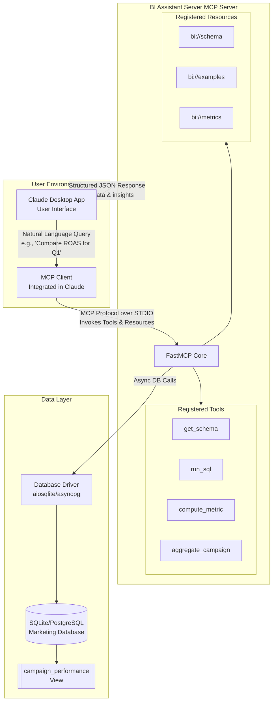

# MCP Powered BI Bot
---

### **Professional Business Objective**

To develop and deploy an AI-native Business Intelligence (BI) Assistant that seamlessly integrates with Claude.ai, enabling marketing and business teams to perform complex campaign performance analysis through natural language conversation. This tool will democratize data access, drastically reduce the time-to-insight from hours to seconds, and empower data-driven decision-making by providing instant, accurate answers to critical business questions about ROI, ROAS, CPA, and other key marketing metrics, without requiring technical SQL knowledge.

---

## **Project Specification: MCP-Powered BI Assistant**

### 1. Project Overview

The MCP-Powered BI Assistant is a server application that acts as a bridge between a structured SQL database and the Anthropic Claude AI. By implementing the Model Context Protocol (MCP), it exposes database tools and resources (like schema information and predefined queries) directly within the Claude interface. This allows users to interrogate their marketing campaign data using plain English, receiving synthesized answers, data visualizations, and actionable insights without leaving their chat environment.

### 2. Tech Stack

| Layer | Technology | Purpose |
| :--- | :--- | :--- |
| **Server & Protocol** | Python, FastMCP | Core server logic and MCP protocol implementation |
| **Database** | SQLite (Development), PostgreSQL (Production) | Structured storage for campaign performance data |
| **Database ORM/Driver** | `aiosqlite`, `asyncpg` | Asynchronous database connectivity |
| **Dependencies** | `pandas`, `sqlalchemy` (optional) | Data manipulation and ORM capabilities |
| **Environment** | `python-dotenv` | Management of configuration and secrets |
| **Packaging & Setup** | Custom `setup.py` | Automated installation and environment configuration |
| **Client** | Claude Desktop App | The user-facing interface that connects to the MCP server |

### 3. Key Functionalities

*   **Schema Discovery & Exploration (`get_schema` tool):** Allows Claude to understand the database structure, table relationships, column types, and view sample data, forming the basis for accurate query generation.
*   **Safe SQL Execution (`run_sql` tool):** Provides a secure endpoint for Claude to execute read-only (`SELECT`, `WITH`) queries against the database and retrieve results in JSON format.
*   **Predefined Metric Calculation (`compute_metric` tool):** Enables users to request specific, complex KPIs (e.g., "What was the ROAS for Product A in March?") without needing to know the underlying SQL formula.
*   **Data Aggregation (`aggregate_campaign` tool):** Fetches filtered and sorted campaign performance data based on product, month, and year, facilitating trend analysis and comparison.
*   **Static Resource Provisioning:** Serves essential documentation directly to Claude as context, including:
    *   `bi://schema`: Database structure overview.
    *   `bi://examples`: Practical query examples for users and the AI.
    *   `bi://metrics`: Definitions and formulas for key marketing metrics (ROAS, ROI, CTR, CPA, CPC, CPM).

### 4. System Architecture

**Flow Description:**
1.  The user asks a question in natural language within the Claude Desktop App.
2.  Claude's integrated MCP Client determines that the BI Assistant's tools are relevant and invokes them over a standard input/output (STDIO) connection.
3.  The BI Assistant Server (FastMCP Core) receives the request, calls the appropriate tool (e.g., `run_sql`), and uses an asynchronous database driver to execute the query.
4.  The database processes the query and returns raw data.
5.  The server packages the results into a structured JSON response and sends it back to the MCP Client.
6.  Claude receives the data, synthesizes it, and formulates a human-readable answer for the user, often including tables or charts.

### 5. Example User Flow

**User Query:**

https://github.com/user-attachments/assets/827134df-455a-4b18-b727-b8ce2b496906

> "What was the Return on Ad Spend for Product A in month 5, and how did it compare to Product B?"

1.  **Claude Analysis:** Claude identifies the need for ROAS calculation for specific products and a time period.
2.  **Tool Selection:** Claude decides to use the `compute_metric` tool twice: once for Product A and once for Product B, both for `month=5` and `metric=roas`.
3.  **Server Execution:** The BI Server receives the two tool calls, executes the corresponding SQL queries against the `campaign_performance` view, and returns the numeric results.
4.  **Synthesis & Response:** Claude receives the two data points (e.g., `Product A ROAS: 4.2`, `Product B ROAS: 3.1`). It calculates the difference, determines that Product A performed ~35% better, and presents the answer in a clear, formatted response to the user.

### 6. Project Deliverables

1.  **Core Application (`bi_server.py`):** The production-ready MCP server application implementing all tools and resources.
2.  **Database Schema & Sample Data (`db.py`):** A script to generate a fully populated SQLite database with a realistic marketing data model for demonstration and testing.
3.  **Automated Setup Script (`setup.py`):** A comprehensive installation and configuration script that handles environment setup, dependency installation, and client (Claude Desktop) integration.
4.  **Technical Documentation:**
    *   **Setup Guide:** Instructions for running the automated setup and manual configuration if needed.
    *   **API Documentation:** Specifications for all exposed MCP tools and resources.
    *   **Usage Examples:** A catalog of sample queries and expected outcomes for users.
5.  **Configuration Files:**
    *   `requirements.txt`: List of Python dependencies.
    *   `.env`: Environment template for database connection and settings.
6.  **Validation Suite (`test_bi_assistant.py`):** A set of tests to verify the server's functionality, tool responses, and database connectivity post-installation.

---

*This prototype demonstrates the power of AI-powered business intelligence, making complex data analysis accessible through natural language interfaces.*
